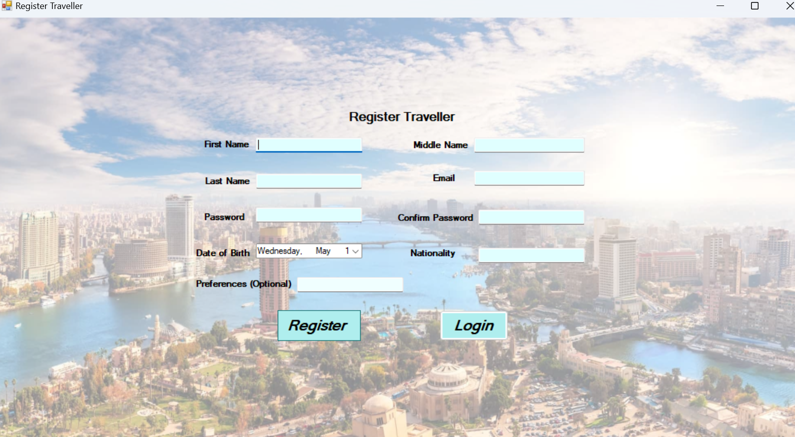

🌍 TravelEase - Travel Management System

TravelEase is a comprehensive travel management system designed to simplify trip planning and management. It connects travelers, service providers, tour operators, and hotels—ensuring a seamless experience from trip search to booking confirmation and payment processing.

✨ Features
🧳 Trip Search & Booking

Search trips by destination, activity type, group size, price, and more.

Compare available options and book instantly.

Traveler Interface Example:


🏨 Service Provider Management

Hotels, tour operators, and other providers can list services.

Manage availability, pricing, and booking status in real-time.

Service Provider Dashboard Example:


📑 Booking Management

Track bookings, confirm or reject requests.

Integrated payment tracking and management.

Admin Booking Panel Example:


📊 Traveler Preferences & Analytics

Gain insights into traveler demographics, preferences, and spending habits.

Providers can optimize offerings using analytics.

Tour Operator Analytics Example:


⚙️ Installation
🔑 Prerequisites

.NET Framework 4.6.2 or higher

SQL Server (or any compatible database)

🚀 Steps to Set Up

Clone the repository:

```
git clone https://github.com/yourusername/TravelEase_DatabaseProject.git
cd TravelEase
```

Open the project in Visual Studio (or your preferred IDE).

Set up the database:

Ensure your SQL Server is running.

Run the SQL scripts in the database folder to set up tables and schema.

Build and run the project:

In Visual Studio, go to Build > Build Solution.

Click Start to run the application.

🎯 Usage
For Travelers

Search for trips using filters (destination, activity type, price, group size).

Select a trip and choose services (accommodation, tours, etc.).

Complete booking with the integrated payment system.

For Service Providers

Log in to the Service Provider Dashboard.

Manage availability, pricing, and bookings.

View traveler data and track payments.

For Tour Operators

Create and manage tours & packages.

Analyze traveler interests and improve offerings.

For Admins

Oversee all bookings and services.

Manage providers, travelers, and financial transactions.

Ensure smooth platform operation.

🤝 Contributing

We welcome contributions! Here’s how you can help:

Fork the repository.

Create a new branch (feature/your-feature-name).

Commit your changes.

Push to your fork.

Open a Pull Request.

📸 Screenshots Overview

Traveler Interface → DB_module2/TravelEase_screenshots/Traveler_Interface/!image

Service Provider Interface → DB_module2/TravelEase_screenshots/ServiceProvider_Interface/!image

Tour Operator Interface → DB_module2/TravelEase_screenshots/TourOperator_Interface/!image

Admin Interface → DB_module2/TravelEase_screenshots/Admin_Interface/!image
